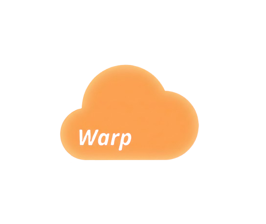

	
    <h1>Warp</h1>
    
<h1>A very-fast & powerful networking library for Roblox.</h1>

---

## Why Warp

### ⚡ Performance
Warp is very-fast with much less bandwidth compared to native.

### 🍃 Lightweight
Warp is a lightweight library for Roblox.

### 📊 Task
Warp optimized efficient for large-scale task.

### 🔎 Typing
Warp written with strictly-typed.

---

Visit Warp [documentation](https://imezx.github.io/Warp)